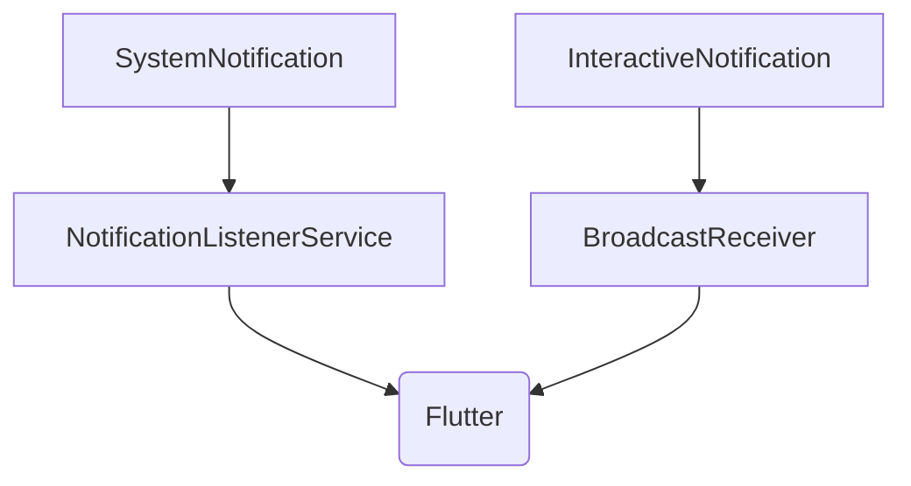

# Native Android Layer

## Module Purpose and Responsibility Bounds
The Native Android layer handles platform-specific features like intercepting incoming notifications and rendering custom interactive notifications. 

## Public API Contracts / Export Interfaces
- **Services:** `NotificationListenerService` (Notification interceptor).
- **Receivers:** `BroadcastReceiver` (for interactive notification actions: Approve, Reject, Edit).
- **MethodChannels:** Flutter <-> Native communication channels.

## Architectural Invariants
- Must run efficiently in the background without waking Flutter engine unnecessarily.
- Fast-fail regex matching for transaction keywords.

## Data Flow Diagram

