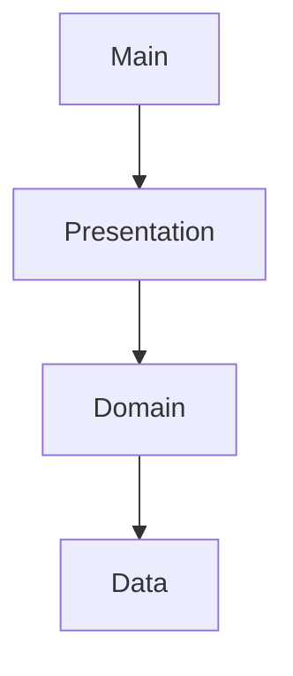

# Application Root

## Module Purpose and Responsibility Bounds
The root `lib/` directory contains the entry point of the Flutter application (`main.dart`) and the high-level architecture layers (`data`, `domain`, `presentation`).

## Public API Contracts / Export Interfaces
- **Entry Point:** `main.dart` configures the `MaterialApp`, handles deep linking, and establishes the dynamic color theme.

## Architectural Invariants
- Enforces Clean Architecture by separating concerns into `data`, `domain`, and `presentation` layers.
- `main.dart` handles cross-cutting concerns like navigation keys and platform method channels for startup intents.

## Data Flow Diagram

