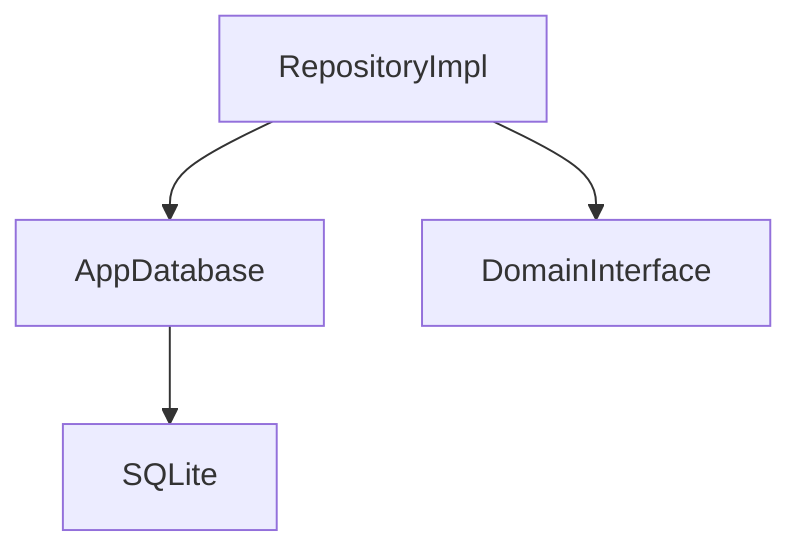

# Data Layer

## Module Purpose and Responsibility Bounds
The Data layer is responsible for the actual implementation of data retrieval, storage, and processing. It implements the contracts defined in the Domain layer using Drift (SQLite) and local services.

## Public API Contracts / Export Interfaces
- **Database:** `AppDatabase` (Drift database).
- **Repositories:** `TransactionRepositoryImpl`, `AppRuleRepositoryImpl`.
- **Data Sources:** Local SQLite tables for transactions and rules.

## Architectural Invariants
- Must depend on the Domain layer.
- All Drift specific logic stays here. The outside world talks only via Domain interfaces.

## Data Flow Diagram

