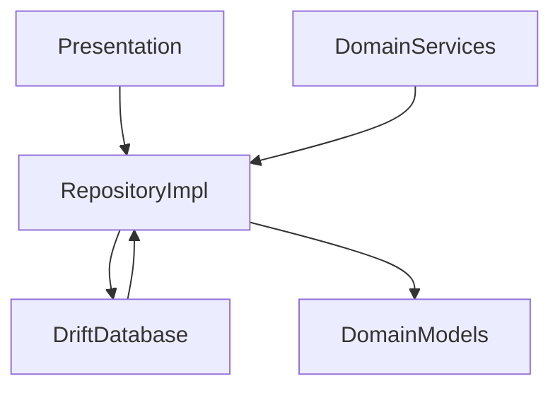

# Data Repositories Layer

## Module Purpose and Responsibility Bounds
The Data Repositories module provides the concrete implementations for domain repository contracts. It encapsulates data access and persistence, abstracting away the underlying Drift SQLite database mechanisms from the rest of the application.

## Public API Contracts / Export Interfaces
- **Implementations:** `TransactionRepositoryImpl`, `AccountRepositoryImpl`.
- These implementations fulfill the interfaces defined in the domain layer.

## Architectural Invariants
- Direct database access via `AppDatabase` is strictly limited to this module.
- Must not contain UI or business logic (e.g., SLM inference).
- Maps raw database entities to clean domain models before returning them.

## Data Flow Diagram

