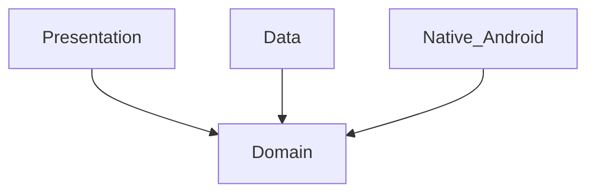

# Domain Layer

## Module Purpose and Responsibility Bounds
The Domain layer contains the core business logic and enterprise rules of the AI Expense Tracker. It is completely independent of external layers (Data, Presentation) and defines the contracts (Repositories, Services) that other layers must implement or use.

## Public API Contracts / Export Interfaces
- **Models:** `Transaction`, `AppRule`, `Account`.
- **Enums:** `TransactionStatus` (`PENDING`, `APPROVED`, `REJECTED`), `TransactionType`, `TransactionCategory`.
- **Services:** `SlmEngineService` (for Gemma 3 interaction), `NotificationInterceptorService` (for platform-channel based intercept).

## Architectural Invariants
- Models must be immutable.
- Domain layer must not depend on `drift`, `flutter_gemma`, or any platform-specific imports.

## Data Flow Diagram

