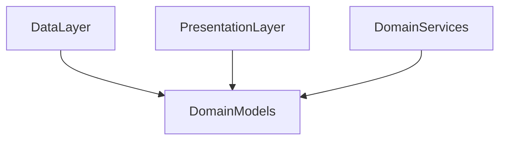

# Domain Models Layer

## Module Purpose and Responsibility Bounds
The Domain Models module defines the core, pure-Dart immutable data structures and enumerations that represent the business entities of the application (e.g., Transactions, Accounts).

## Public API Contracts / Export Interfaces
- **Entities:** `Transaction`, `Account`.
- **Enums:** Various business enumerations like `TransactionCategory`, `TransactionType`, `TransactionStatus`.

## Architectural Invariants
- Models must be completely immutable (`final` fields) and pure Dart.
- Must not import Flutter UI libraries or external data persistence libraries.
- Provides `copyWith` and other domain-specific helper methods.

## Data Flow Diagram

