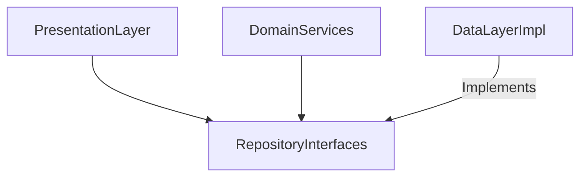

# Domain Repositories Layer

## Module Purpose and Responsibility Bounds
The Domain Repositories module defines the abstract contracts (interfaces) for data persistence operations. It outlines what data operations are possible without dictating how they are implemented.

## Public API Contracts / Export Interfaces
- **Interfaces:** `TransactionRepository`, `AccountRepository`.

## Architectural Invariants
- Must consist only of abstract classes and method signatures.
- Must not depend on the `data` layer or any specific database implementation (e.g., Drift).
- Establishes the boundaries that the `data` layer must adhere to via dependency inversion.

## Data Flow Diagram

