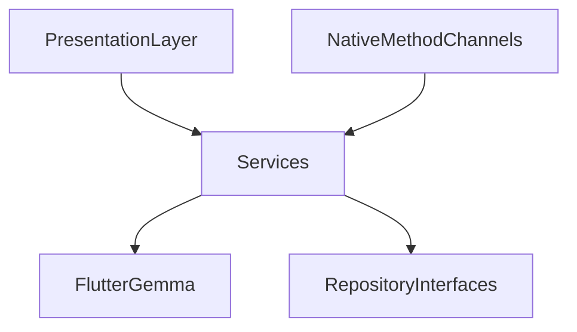

# Domain Services Layer

## Module Purpose and Responsibility Bounds
The Domain Services module encapsulates core business logic and side-effect coordination that doesn't belong purely in a repository or presentation widget. This includes coordinating on-device SLM inference and bridging native notification data.

## Public API Contracts / Export Interfaces
- **Services:** `SlmEngineService`, `NotificationBridgeService`.

## Architectural Invariants
- Acts as the orchestrator between raw data (repositories or native channels) and complex business requirements (AI categorization).
- Should be state-independent where possible, relying on injected or singleton instances for orchestration.
- Must not contain UI rendering code.

## Data Flow Diagram

