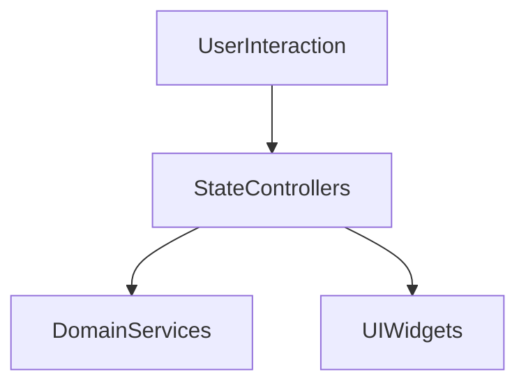

# Presentation Layer

## Module Purpose and Responsibility Bounds
The Presentation layer is responsible for rendering the UI using Material 3 Expressive design, handling user interactions, and managing local UI state. 

## Public API Contracts / Export Interfaces
- **Views:** DashboardView, AuditLogView.
- **State Management:** Riverpod or Provider (standard flutter paradigms) for state bridging to domain services.
- **Widgets:** Custom Material 3 Expressive components (sparklines, fluid cards).

## Architectural Invariants
- Must not perform direct database access or SLM inference.
- Must communicate only via Domain layer services and use cases.
- UI must follow Material 3 Expressive guidelines.

## Data Flow Diagram

