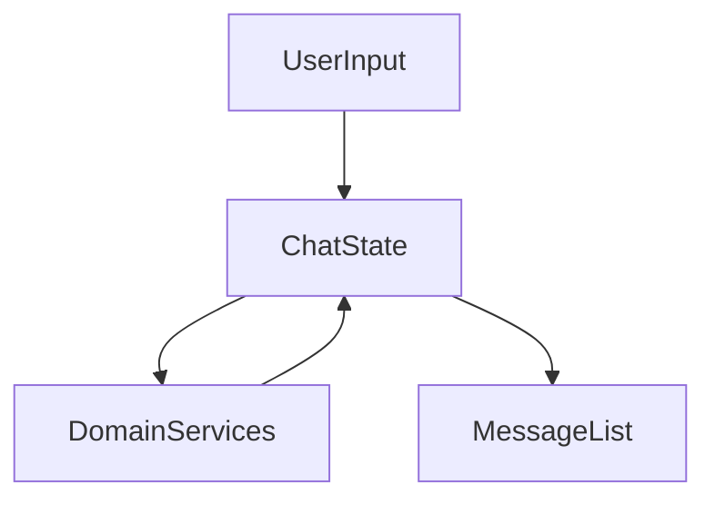

# Presentation Chat Layer

## Module Purpose and Responsibility Bounds
The Chat module provides the conversational UI for the AI assistant. It handles user text input and renders the conversation history using standard Flutter UI components.

## Public API Contracts / Export Interfaces
- **Views:** `ChatView`.
- **State Management:** Plain `StatefulWidget` for managing local message state.

## Architectural Invariants
- UI follows Material 3 Expressive guidelines.
- Should interact with the domain layer for SLM intelligence rather than performing inference directly.

## Data Flow Diagram

