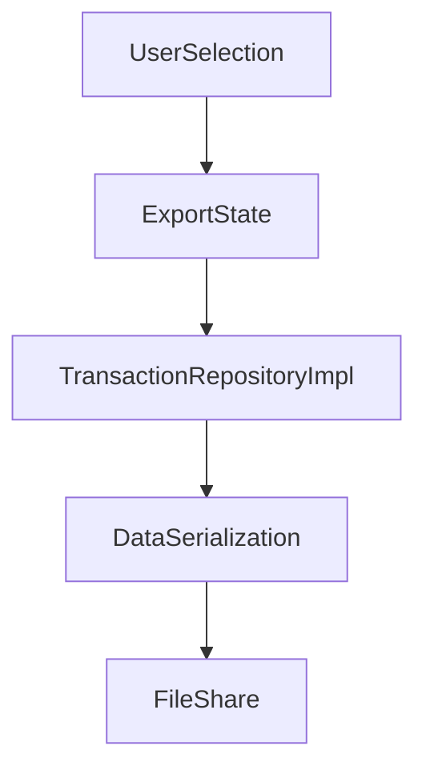

# Presentation Export Layer

## Module Purpose and Responsibility Bounds
The Export module provides the UI and logic for exporting transaction data. It allows users to reorder columns, select specific fields, and export data in either CSV or JSON formats.

## Public API Contracts / Export Interfaces
- **Views:** `ExportView`.
- **State Management:** Plain `StatefulWidget` for tracking column visibility, order, and format selection.

## Architectural Invariants
- Fetches all transactions directly via `TransactionRepositoryImpl`.
- Relies on `path_provider` and `share_plus` to serialize data to a temporary file and invoke the native share sheet.

## Data Flow Diagram

