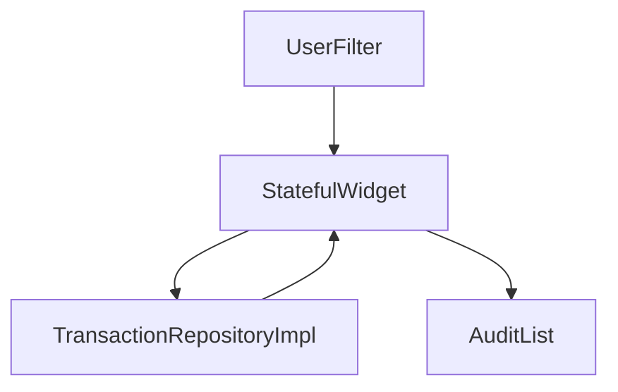

# Presentation History Layer

## Module Purpose and Responsibility Bounds
The History module provides the audit log view, allowing users to review and filter past transactions (e.g., by category or status).

## Public API Contracts / Export Interfaces
- **Views:** `AuditLogView`.
- **State Management:** Plain `StatefulWidget` paired with direct repository calls.

## Architectural Invariants
- Directly instantiates `TransactionRepositoryImpl` to query historical data.
- UI displays immutable transaction records using Material 3 design.

## Data Flow Diagram

