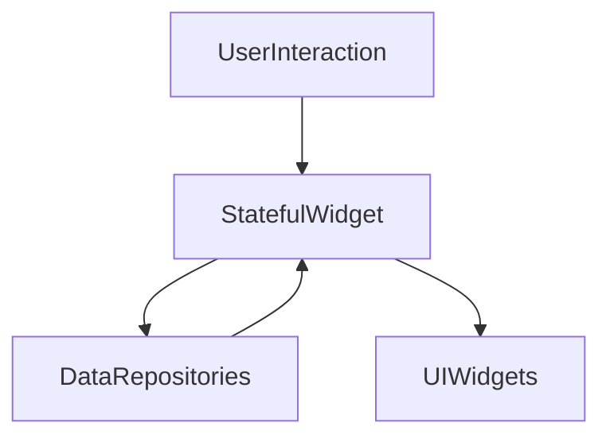

# Presentation Home Layer

## Module Purpose and Responsibility Bounds
The Home module is responsible for rendering the main dashboard and the edit transaction view. It manages local UI state using `StatefulWidget` and handles user interactions such as viewing account balances, budget tracking, and modifying individual transactions.

## Public API Contracts / Export Interfaces
- **Views:** `DashboardView`, `EditTransactionView`.
- **State Management:** Plain `StatefulWidget` with direct repository instantiation.

## Architectural Invariants
- UI must follow Material 3 Expressive guidelines.
- Uses direct instantiation of Data layer repositories (e.g. `TransactionRepositoryImpl`, `AccountRepositoryImpl`) for fetching and updating data.

## Data Flow Diagram

