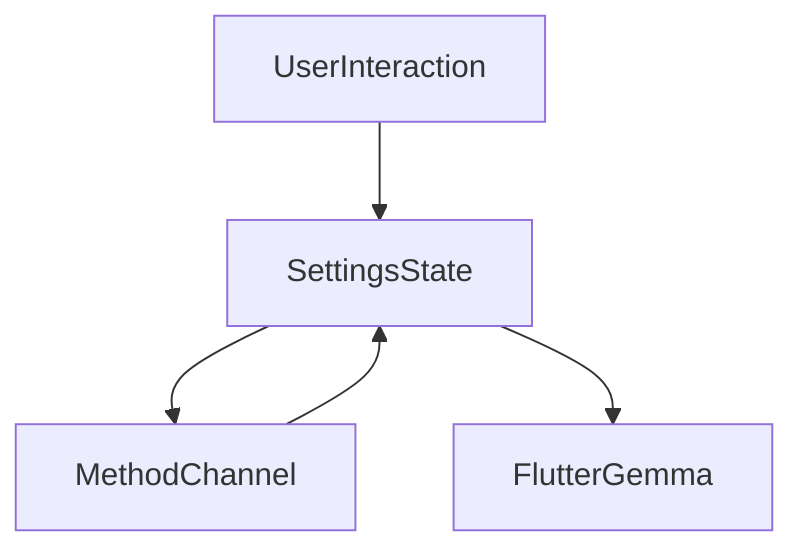

# Presentation Settings Layer

## Module Purpose and Responsibility Bounds
The Settings module manages user preferences, system configurations, AI model downloads, and notification listener permissions.

## Public API Contracts / Export Interfaces
- **Views:** `SettingsView`.
- **State Management:** Plain `StatefulWidget` integrated with `MethodChannel` for native system settings.

## Architectural Invariants
- Communicates heavily with native code via `MethodChannel` (`com.agamairi.ai_expense_tracker/actions`).
- Direct integration with `flutter_gemma` for downloading the SLM to the device.

## Data Flow Diagram

